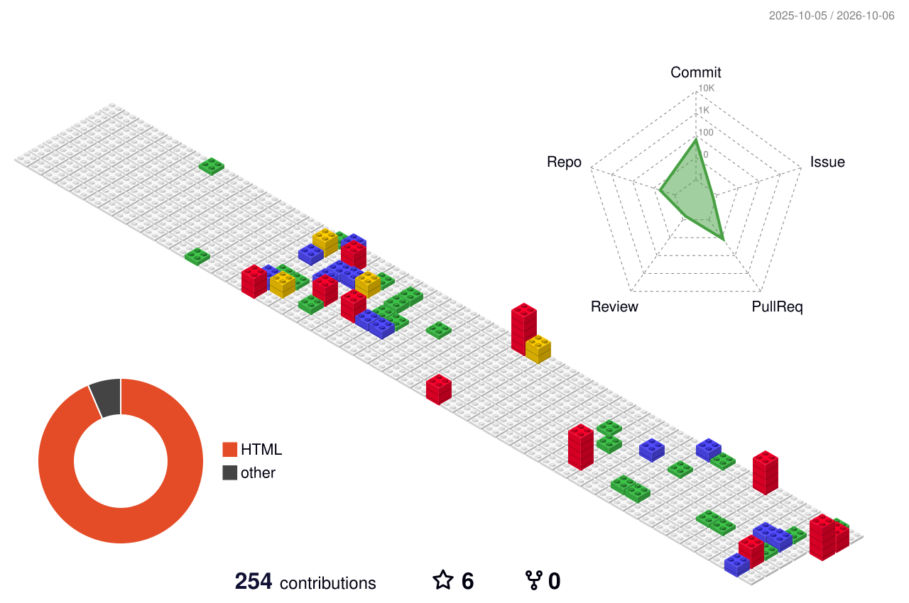

<!-- ============================ HEADER ============================ -->
<p align="center">
  
</p>

<p align="center">
  <a href="https://github.com/abdelkhalekbakkari">
    
  </a>
</p>

<p align="center">
  <a href="mailto:abdelkhalek@smartovate.com"></a>
  <a href="https://www.linkedin.com/in/abdelkhalekbakkari/"></a>
  <a href="https://about.me/abdelkhalek.bakkari"></a>
</p>

<p align="center">
  
  
  
  
</p>

---

## 👋 About me

I'm a **Technical Team Leader and Senior Full-Stack Engineer** with **17 years of experience** turning business ideas into reliable, scalable software.
I lead teams and build hands-on across the whole stack: **Python/Django backends**, **React frontends**, **AI/LLM & RAG systems**, and the **DevOps** that keeps them running in production.

I care about the details that make products succeed: clean architecture, performance, security, test coverage, and code your team can maintain long after launch.

```python
class AbdelkhalekBakkari:
    role        = "Technical Team Leader · Senior Full-Stack · AI/LLM & RAG Engineer"
    experience  = "17 years"
    backend     = ["Python", "Django", "Django REST Framework", "FastAPI", "Node.js"]
    frontend    = ["React", "Redux", "TypeScript", "Next.js", "Material UI"]
    ai          = ["LLMs", "RAG", "LangChain", "Vector databases", "AI agents"]
    devops      = ["Docker", "CI/CD", "GitHub Actions", "Linux", "Cloud"]
    focus       = "Shipping products that are fast, secure and built to last"

    def availability(self):
        return "Open to freelance, contract & consulting projects 🚀"
```

---

## 💼 How I can help your business

| Service | What you get |
|---|---|
| 🧠 **AI & LLM Solutions** | Custom chatbots, RAG systems over your own documents, AI agents, LLM integration into existing products |
| 🌐 **Full-Stack Web Apps** | SaaS platforms, dashboards, marketplaces and internal tools with Django + React |
| 🔌 **APIs & Integrations** | Well-documented REST APIs (Swagger/OpenAPI), third-party integrations, payment and auth flows |
| ⚙️ **DevOps & Cloud** | Dockerized deployments, CI/CD pipelines, monitoring, performance and cost optimization |
| 🧭 **Tech Leadership** | Architecture reviews, code audits, team mentoring, rescuing and modernizing legacy projects |

> **Have a project in mind?** [Send me a message](mailto:abdelkhalek@smartovate.com) with a short description. I reply within 24 hours.

---

## 🛠️ Tech stack

**Backend**
<p>
  
  
  
  
  
  
  
</p>

**Frontend**
<p>
  
  
  
  
  
  
  
</p>

**AI / LLM / RAG**
<p>
  
  
  
  
  
</p>

**Databases**
<p>
  
  
  
  
</p>

**DevOps & Tools**
<p>
  
  
  
  
  
  
  
  
</p>

---

## 🚀 Featured projects

<!-- Replace the repo names below with your best public repositories.
     Pick 4 projects that show different skills: an AI/RAG app, a Django+React platform, an API, a DevOps setup. -->

<p align="center">
  <a href="https://github.com/abdelkhalekbakkari/REPO_1">
    
  </a>
  <a href="https://github.com/abdelkhalekbakkari/REPO_2">
    
  </a>
  <a href="https://github.com/abdelkhalekbakkari/REPO_3">
    
  </a>
  <a href="https://github.com/abdelkhalekbakkari/REPO_4">
    
  </a>
</p>

---

## 📊 GitHub activity

<!-- 3D contribution graph: generated daily from YOUR data by .github/workflows/profile-3d.yml -->
<p align="center">
  
</p>

<p align="center">
  
  
</p>

<p align="center">
  
</p>

<p align="center">
  
</p>

<p align="center">
  
</p>

---

## 🏆 Coding profiles

<p>
  <a href="https://www.hackerrank.com/abdelkhalek_bak1"></a>
  <a href="https://www.codewars.com/users/Abdelkhalek%20Bakkari"></a>
  <a href="https://codepen.io/AbdelkhalekBakkari"></a>
  <a href="https://codesandbox.io/u/Abdelkhalek-Bakkari"></a>
</p>

---

## 🤝 Let's work together

I'm currently **open to freelance, contract and consulting work**, whether you need a full product built, an AI feature added to your platform, or senior leadership for your dev team.

<p align="center">
  <a href="mailto:abdelkhalek@smartovate.com"></a>
  <a href="https://www.linkedin.com/in/abdelkhalekbakkari/"></a>
  <a href="https://github.com/abdelkhalekbakkari"></a>
</p>

<p align="center">
  
</p>
